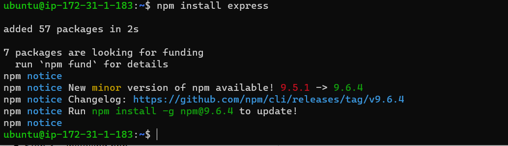

## DOCUMENTATION OF THE PROJECT3-MERN IMPLEMENTATION

`sudo apt update`

`sudo apt upgrade`

`curl -fsSL https://deb.nodesource.com/setup_18.x | sudo -E bash -`

`sudo apt-get install -y nodejs`

## INSTALL EXPRESSJS-It is framework for Node.js

## To use expreesjs, install it use npm;

`npm install express`

## create a file index.js with the command below

`touch index.js`

## Install the dotenv module

`npm install dotenv`

