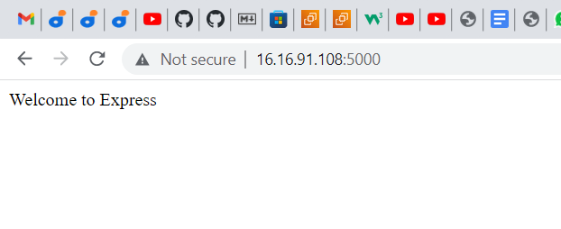

## DOCUMENTATION OF THE PROJECT3-MERN IMPLEMENTATION

`sudo apt update`

`sudo apt upgrade`

`curl -fsSL https://deb.nodesource.com/setup_18.x | sudo -E bash -`

`sudo apt-get install -y nodejs`

## INSTALL EXPRESSJS-It is framework for Node.js

## To use expreesjs, install it use npm;

`npm install express`

## create a file index.js with the command below

`touch index.js`

## Install the dotenv module

`npm install dotenv`

## Open the index.js file with

`vim index.js`

## start our server to see if it works

`node index.js`

## Open up your browser and try to access your server

`http://<PublicIP-or-PublicDNS>:5000`

## TO DO LIST APPLICATION

1. Create a new task
2. Display list of all tasks
3. Delete a completed task

## Each task will be associated with some particular endpoint and will use different standard HTTP request methods: POST, GET, DELETE.

## For each task, we need to create routes that will define various endpoints that the To-do app will depend on. So let us create a folder routes

`mkdir routes`

## Change directory to routes folder

`cd routes`

## create a file api.js

`touch api.js`

`vm api.js`

